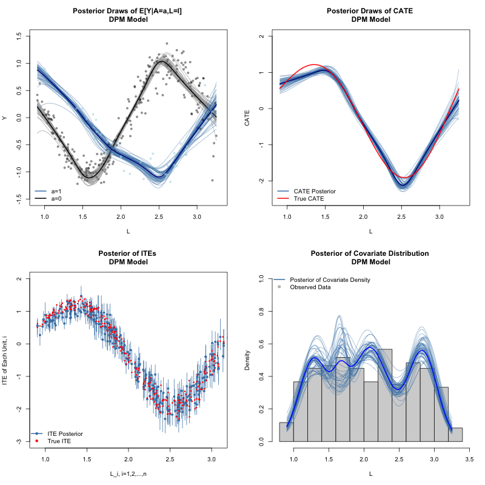

# Untangling Sample and Population Level Estimands in Bayesian Causal Inference



This repository contains example code used in the paper "Untangling Sample and Population Level Estimands in Bayesian Causal Inference":

[https://arxiv.org/abs/2508.15016](https://arxiv.org/abs/2508.15016)

If using LaTeX, you can cite in the .bib file as:

```
@misc{oganisian2025untangle,
      title={Untangling Sample and Population Level Estimands in Bayesian Causal Inference}, 
      author={Arman Oganisian},
      year={2025},
      eprint={2508.15016},
      archivePrefix={arXiv},
      primaryClass={stat.ME},
      url={https://arxiv.org/abs/2508.15016}, 
}

```


