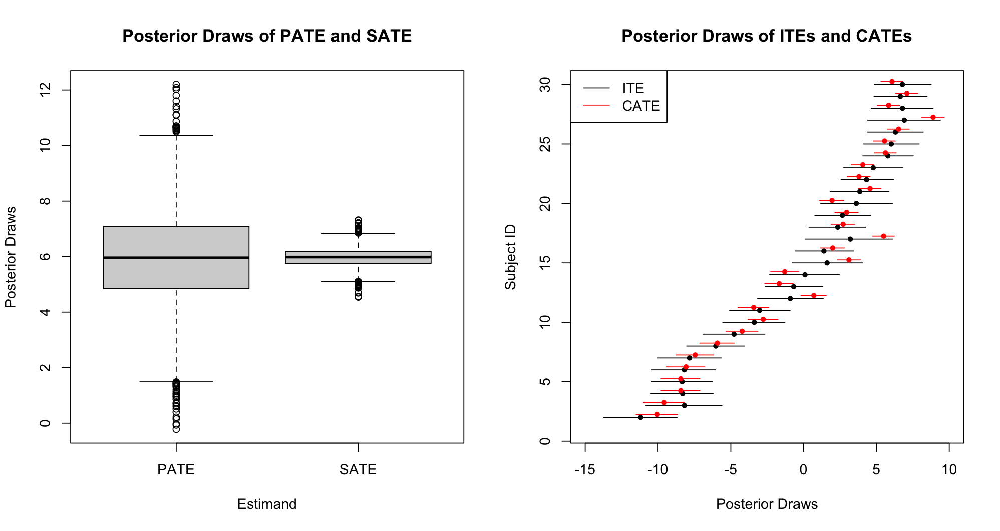

# Untangling Sample and Population Level Estimands in Bayesian Causal Inference



This repository contains example code used in the paper "Untangling Sample and Population Level Estimands in Bayesian Causal Inference":


If using LaTeX, you can cite in the .bib file as:

```


```


